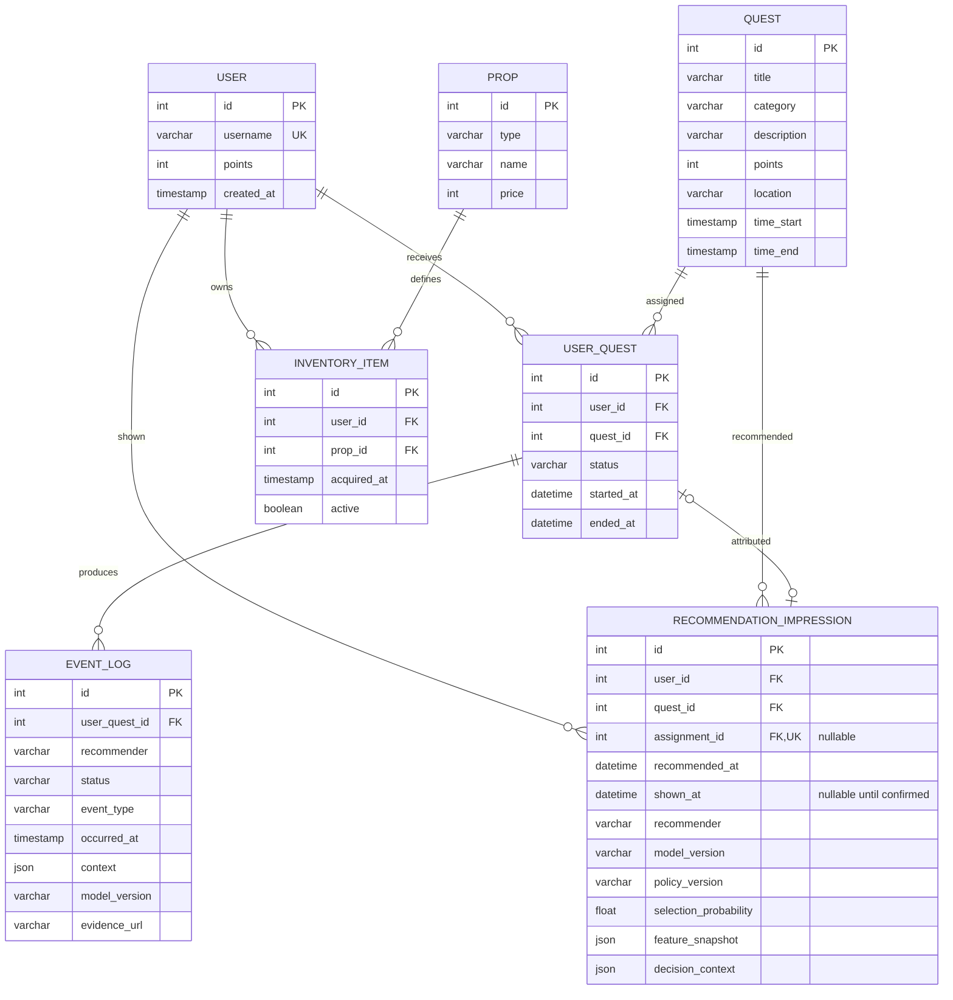

# Lifescape ERD

```mermaid
erDiagram
    USER ||--o{ USER_QUEST : receives
    QUEST ||--o{ USER_QUEST : assigned
    USER_QUEST ||--o{ EVENT_LOG : produces
    USER ||--o{ INVENTORY_ITEM : owns
    PROP ||--o{ INVENTORY_ITEM : defines
    USER ||--o{ RECOMMENDATION_IMPRESSION : shown
    QUEST ||--o{ RECOMMENDATION_IMPRESSION : recommended
    USER_QUEST |o--o| RECOMMENDATION_IMPRESSION : attributed

    USER {
        int id PK
        varchar username UK
        int points
        timestamp created_at
    }
    QUEST {
        int id PK
        varchar title
        varchar category
        varchar description
        int points
        varchar location
        timestamp time_start
        timestamp time_end
    }
    USER_QUEST {
        int id PK
        int user_id FK
        int quest_id FK
        varchar status
        datetime started_at
        datetime ended_at
    }
    PROP {
        int id PK
        varchar type
        varchar name
        int price
    }
    INVENTORY_ITEM {
        int id PK
        int user_id FK
        int prop_id FK
        timestamp acquired_at
        boolean active
    }
    RECOMMENDATION_IMPRESSION {
        int id PK
        int user_id FK
        int quest_id FK
        int assignment_id FK,UK "nullable"
        datetime recommended_at
        datetime shown_at "nullable until confirmed"
        varchar recommender
        varchar model_version
        varchar policy_version
        float selection_probability
        json feature_snapshot
        json decision_context
    }
    EVENT_LOG {
        int id PK
        int user_quest_id FK
        varchar recommender
        varchar status
        varchar event_type
        timestamp occurred_at
        json context
        varchar model_version
        varchar evidence_url
    }
```
